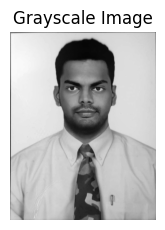
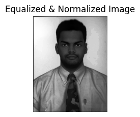
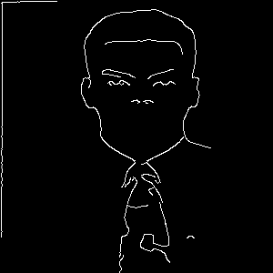
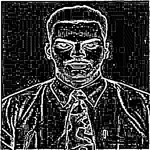
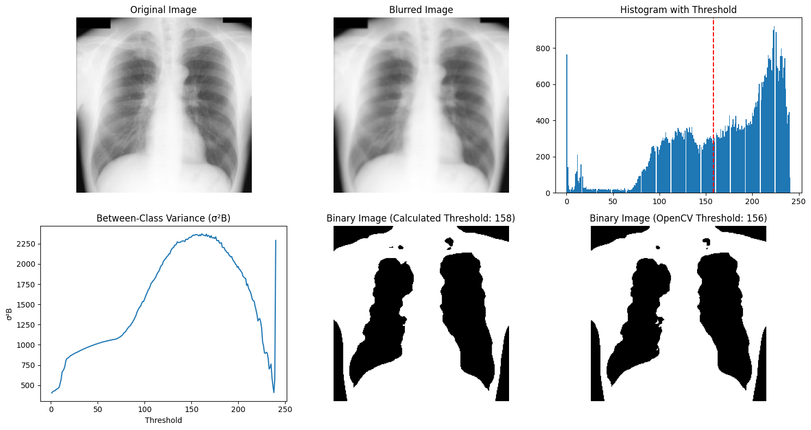
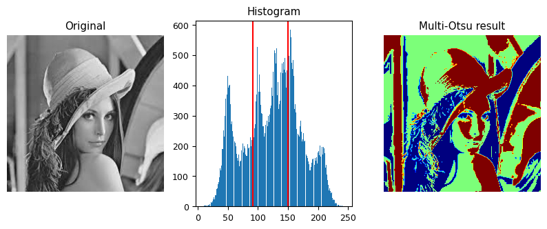
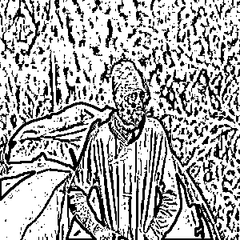
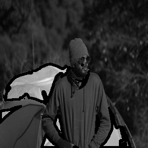

# Image Processing Techniques: A Comprehensive Guide

This repository demonstrates a variety of image processing techniques using Python libraries such as **OpenCV**, **PIL**, and **Matplotlib**. The project includes grayscale conversion, normalization, equalization, edge detection, thresholding (single and multi-level Otsu's), and contour detection.

---

## Table of Contents

1. [Overview](#overview)
2. [Techniques Implemented](#techniques-implemented)
3. [Requirements](#requirements)
4. [Results](#results)
5. [Usage](#usage)
6. [Conclusion](#conclusion)

---

## Overview

This project applies common image processing techniques to pre-process images for tasks like object detection, segmentation, and feature extraction. The techniques are useful for various computer vision applications such as medical imaging, facial recognition, and edge detection.

---

## Techniques Implemented

1. **Grayscale Conversion**
   - Converts the input image to a grayscale format for simplification.

2. **Normalization and Histogram Equalization**
   - Enhances image contrast and brightness for better feature visualization.

3. **Edge Detection**
   - Sobel and Canny operators are used to detect edges in an image.

4. **Thresholding**
   - Converts the image into a binary format using global and adaptive thresholding.

5. **Otsu's Single and Multi-Thresholding**
   - Automatically determines optimal thresholds for binarization:
     - **Single Thresholding**: Divides the image into two classes (foreground and background).
     - **Multi-Thresholding**: Divides the image into multiple regions.

6. **Contour Detection**
   - Identifies and outlines object boundaries within the image.

7. **Gaussian Blurring**
   - Reduces image noise and smoothens the edges for further processing.

8. **Laplacian Filtering**
   - Highlights regions of rapid intensity changes (useful for edge detection).

---

## Requirements

Ensure you have the following Python libraries installed:

- **OpenCV**: `pip install opencv-python`
- **PIL**: `pip install pillow`
- **Matplotlib**: `pip install matplotlib`
- **NumPy**: `pip install numpy`
- **scikit-image**: `pip install scikit-image`

---

## Results

### 1. Grayscale Conversion
The input image is converted to grayscale.

**Result:**



---

### 2. Normalization and Equalization
The image is normalized and its contrast is equalized.

**Result:**



---

### 3. Edge Detection
- **Canny Edge Detection**:
  Detects sharp edges in the image.

**Result:**



- **Laplacian Filtering**:
  Highlights edges based on intensity changes.

**Result:**



---

### 4. Otsu's Single and Multi-Thresholding

#### **Otsu's Single Thresholding**
Otsu's method automatically determines a single threshold value to separate the image into foreground and background.

**Result:**



#### **Otsu's Multi-Thresholding**
Multi-level Otsu thresholding divides the image into multiple regions based on pixel intensities.

**Result:**



---

### 5. Thresholding
The image is binarized using adaptive thresholding.

**Result:**



---

### 6. Contour Detection
Contours are drawn around objects in the binary image.

**Result:**



---

## Usage

1. **Clone the Repository**:

   ```bash
   git clone https://github.com/your-username/image-processing-techniques.git
   cd image-processing-techniques
